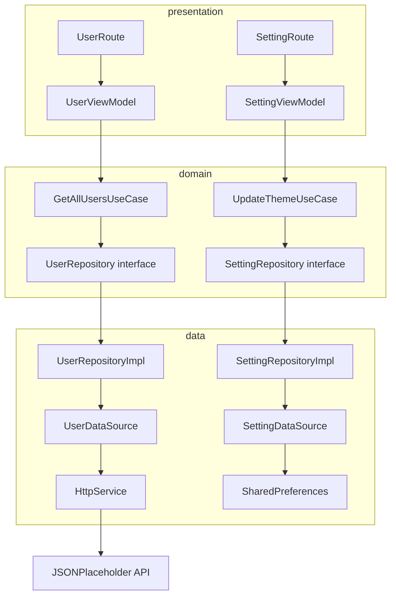

# Provider With Clean Arch

Clean Architecture sample with Provider wiring presentation, domain, and data layers.

Use cases orchestrate business rules; repositories and data sources return `ResultPattern` instead of throwing.

Users and settings features mirror the same layer boundaries for consistent testing.

Shared modules provide HTTP, connectivity checks, storage, routing, and state management abstractions.

Full test pyramid across data sources, repositories, use cases, and view models with CI analyze enabled.

## Structure



## Stack

| Technology | Version |
|------------|---------|
| Dart SDK | ^3.13.3 |
| connectivity_plus | ^7.0.0 |
| cupertino_icons | ^1.0.8 |
| dio | ^5.9.2 |
| provider | ^6.1.5+1 |
| go_router | ^17.2.3 |
| shared_preferences | ^2.5.5 |
| flutter_lints | ^6.0.0 |
| build_runner | ^2.15.0 |
| mockito | ^5.6.4 |
| Android Gradle Plugin | 9.1.0 |
| Kotlin | 2.4.0 |
| compileSdk / targetSdk | 36 |
| minSdk | 29 |
| JVM | 25 |
| iOS Deployment Target | 15.0 |
| Swift | 5.0 |

## Architecture

```
lib/
    └── src/
        ├── common/
        │   ├── constants/
        │   ├── dependency_injectors/
        │   ├── enums/
        │   ├── extensions/
        │   ├── patterns/
        │   ├── routes/
        │   ├── services/
        │   ├── state_management/
        │   └── widgets/
        └── features/
            ├── feature_one/
            │   ├── data/
            │   │   ├── data_sources/
            │   │   ├── models/
            │   │   └── repositories/
            │   ├── domain/
            │   │   ├── entities/
            │   │   ├── repositories/
            │   │   └── usecases/
            │   └── presentation/
            │       ├── routes/
            │       ├── view_models/
            │       └── views/
            └── feature_two/
                ├── data/
                │   ├── data_sources/
                │   ├── models/
                │   └── repositories/
                ├── domain/
                │   ├── entities/
                │   ├── repositories/
                │   └── usecases/
                └── presentation/
                    ├── routes/
                    ├── view_models/
                    └── views/
```

## Coverage

flutter pub run build_runner build --delete-conflicting-outputs

flutter test --coverage

genhtml coverage/lcov.info -o coverage/html

open coverage/html/index.html

## ScreenShots

| Image 1 | Image 2 | Image 3 |
|----------|----------|----------|
|  |  |  |

| Image 4 | Image 5 | Image 6 |
|----------|----------|----------|
|  |  |  |

## Commits

```
git add . && git commit -m ":rocket: Initial commit." && git push
git add . && git commit -m ":building_construction: Added initial project architecture." && git push
git add . && git commit -m ":building_construction: Update project architecture." && git push
git add . && git commit -m ":memo: Updated project documentation." && git push
git add . && git commit -m ":memo: Updated code documentation." && git push
git add . && git commit -m ":white_check_mark: Added feature xyz." && git push
git add . && git commit -m ":wrench: Fixed xyz usage." && git push
git add . && git commit -m ":heavy_minus_sign: Removed xyz." && git push
git add . && git commit -m ":memo: Adjusted project imports." && git push
git add . && git commit -m ":arrow_up: Updated dependencies." && git push
git add . && git commit -m ":arrow_down: Removed dependencies." && git push
git add . && git commit -m ":wastebasket: Removed unused code." && git push
git add . && git commit -m ":test_tube: Added test functionality xyz." && git push
git add . && git commit -m ":construction_worker: Building in progress." && git push
git add . && git commit -m ":construction_worker: Added CI build system." && git push
```

## License

[MIT License](https://opensource.org/licenses/MIT)

Copyright (c) 2026 William Franco.

